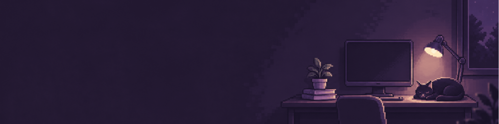

<div align="center">



<br />

# Full-stack developer with an artistic side 🌙

*I enjoy turning ideas into thoughtful digital experiences - one component and one cup of tea at a time.*

[](https://www.linkedin.com/in/sukitta-budsaba)
</br>
[](https://www.instagram.com/jamiejip_/)

</div>

---

### ✦ A little about me

```text
🌱  Learning       Cloud · Authentication · Full-stack architecture
🎨  Creating       Useful interfaces with thoughtful little details
📚  Off-screen     Reading · Painting · Crocheting
🐾  Studio mates   My Cat & dog
```

I’m growing into a well-rounded full-stack developer who cares about both how things **work** and how they **feel**. I like clean systems, warm visuals, and making technology a little more human.

### ✦ My toolkit

<div align="center">

**Frontend**


**Backend & Data**


**Tools & Creative**


</div>

### ✦ GitHub at a glance

<div align="center">


<br />


</div>

---

<div align="center">

*Thanks for visiting my little corner of GitHub* ✦

</br>


</div>
